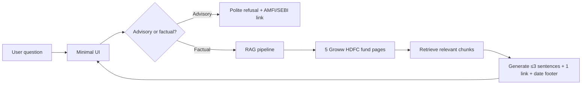

# Problem Statement: Mutual Fund FAQ Assistant (Facts-Only Q&A)

## Overview

The objective of this project is to build a **facts-only FAQ assistant** for mutual fund schemes, using **Groww** as the reference product context. The assistant will answer objective, verifiable queries related to mutual funds by retrieving information exclusively from official public sources, such as AMC (Asset Management Company) websites, AMFI, and SEBI.

The system must strictly avoid providing investment advice, opinions, or recommendations. Every response must include a single, clear source link and adhere to defined constraints around clarity, accuracy, and compliance.

### What This Project Is

You are building a **Mutual Fund FAQ Assistant** — a chatbot-style Q&A system that answers **only factual, verifiable questions** about mutual fund schemes. It is modeled after products like **Groww**, but the focus is compliance and accuracy, not investment guidance.

The core idea: users ask questions like "What is the expense ratio of Fund X?" or "Who manages HDFC Defence Fund?" and the system answers using **allowlisted source pages only** (currently 5 Groww HDFC fund pages), with a **source link** and **no advice**.

### Approved Data Sources

| Source | Role |
|--------|------|
| **AMC websites** | Asset Management Companies (e.g., HDFC AMC, SBI Mutual Fund) publish scheme documents |
| **AMFI** | Association of Mutual Funds in India; industry body with investor education |
| **SEBI** | Securities and Exchange Board of India; regulator |

### Hard Rules

- No investment advice, opinions, or recommendations
- Every answer must have **one clear source link**
- Responses must be clear, accurate, and compliant

---

## Objective

Design and implement a lightweight **Retrieval-Augmented Generation (RAG)**-based assistant that:

- Answers factual queries about mutual fund schemes and fund management
- Uses a curated corpus of official documents
- Provides concise, source-backed responses

### How RAG Fits In

The technical approach is **RAG (Retrieval-Augmented Generation)**:

1. **Retrieve** relevant chunks from a curated document corpus
2. **Augment** the LLM prompt with those chunks
3. **Generate** a short, factual answer grounded in those sources

| Requirement | Meaning |
|-------------|---------|
| Answer factual queries | Only objective facts (ratios, lock-in, benchmarks, fund management, etc.) |
| Curated corpus | Fixed set of 5 Groww HDFC fund pages (expandable to official AMC/AMFI/SEBI docs) |
| Concise, source-backed | Short answers with citations — not long essays |

"Lightweight" suggests a simple stack: ingest docs → embed → retrieve → generate — not a full production platform.

---

## Target Users

- **Retail investors** comparing mutual fund schemes — people who want quick, trustworthy facts (expense ratio, exit load, minimum SIP, fund manager details, etc.) without talking to an advisor
- **Customer support and content teams** handling repetitive mutual fund queries — internal users who field standard questions (e.g., "How do I download my capital gains statement?")

---

## Scope of Work

### 1. Corpus Definition

**Selected AMC:** HDFC Mutual Fund

For the current phase, the corpus is limited to **5 Groww fund pages** (reference product context). These pages surface scheme-level facts such as expense ratio, exit load, minimum SIP, risk classification, benchmark, and fund manager details.

| # | Scheme | URL |
|---|--------|-----|
| 1 | HDFC Mid Cap Fund Direct Growth | https://groww.in/mutual-funds/hdfc-mid-cap-fund-direct-growth |
| 2 | HDFC Large Cap Fund Direct Growth | https://groww.in/mutual-funds/hdfc-large-cap-fund-direct-growth |
| 3 | HDFC Small Cap Fund Direct Growth | https://groww.in/mutual-funds/hdfc-small-cap-fund-direct-growth |
| 4 | HDFC Gold ETF Fund of Fund Direct Plan Growth | https://groww.in/mutual-funds/hdfc-gold-etf-fund-of-fund-direct-plan-growth |
| 5 | HDFC Defence Fund Direct Growth | https://groww.in/mutual-funds/hdfc-defence-fund-direct-growth |

**Scheme coverage at a glance:**

| Scheme | Category | Risk |
|--------|----------|------|
| HDFC Mid Cap Fund Direct Growth | Equity — Mid Cap | Very High |
| HDFC Large Cap Fund Direct Growth | Equity — Large Cap | Very High |
| HDFC Small Cap Fund Direct Growth | Equity — Small Cap | Very High |
| HDFC Gold ETF Fund of Fund Direct Plan Growth | Commodities — Gold | High |
| HDFC Defence Fund Direct Growth | Equity — Thematic (Defence) | Very High |

**Facts available per page (examples):**

- Expense ratio, minimum SIP, exit load, stamp duty, tax implications
- Fund benchmark and investment objective
- Risk classification, AUM, NAV
- **Fund management data** — manager name(s), tenure, education, experience, and other schemes managed
- Links to official SID on AMC site

**Fund management data (in scope):**

Each Groww fund page includes a **Fund management** section. The chatbot must answer factual queries about:

| Data point | Example question |
|------------|------------------|
| Fund manager name | "Who is the fund manager of HDFC Mid Cap Fund?" |
| Tenure | "Since when has Priya Ranjan been managing HDFC Defence Fund?" |
| Education / qualifications | "What is the educational background of the HDFC Large Cap Fund manager?" |
| Prior experience | "What is the work experience of the fund manager?" |
| Other schemes managed | "Which other schemes does Dhruv Muchhal manage?" |

This corpus is what you **index** for RAG. Answers must cite **one of these five source URLs** (or an official AMC/AMFI/SEBI link surfaced from them, such as the SID).

> **Note:** The original spec targets 15–25 official AMC/AMFI/SEBI URLs. The current MVP intentionally scopes down to these 5 Groww pages for faster iteration. The corpus can be expanded later with HDFC factsheets, KIM, SID PDFs, and AMFI/SEBI guidance pages.

### 2. FAQ Assistant Requirements

The assistant must answer **facts-only queries**, such as:

**Scheme details:**

- Expense ratio of a scheme
- Exit load details
- Minimum SIP amount
- ELSS lock-in period
- Riskometer classification
- Benchmark index
- Process to download statements or capital gains reports

**Fund management:**

- Who is the current fund manager of a scheme
- Since when a fund manager has been managing the scheme
- Fund manager's education and professional qualifications
- Fund manager's prior work experience
- Other schemes managed by the same fund manager

**Response requirements:**

- Each response is limited to a **maximum of 3 sentences**
- Each response includes **exactly one citation link**
- Each response includes a footer:
  > Last updated from sources: <date>

**Example response shape (scheme detail):**

> The expense ratio of HDFC Defence Fund Direct Growth is 0.88%.
> Source: https://groww.in/mutual-funds/hdfc-defence-fund-direct-growth
> Last updated from sources: 2026-06-01

**Example response shape (fund management):**

> Priya Ranjan has been managing HDFC Defence Fund Direct Growth since April 2025. He holds a B.E. in Computer Science and a PGDBM in Finance, with over 14 years of experience in equity research.
> Source: https://groww.in/mutual-funds/hdfc-defence-fund-direct-growth
> Last updated from sources: 2026-06-01

### 3. Refusal Handling

The assistant must refuse non-factual or advisory queries, such as:

- "Should I invest in this fund?"
- "Which fund is better?"

**Refusal responses should:**

- Be polite and clearly worded
- Reinforce the facts-only limitation
- Provide a relevant educational link (e.g., AMFI or SEBI resource)

This is a **compliance feature** — you'll likely need intent classification or prompt rules to detect advisory queries before retrieval.

### 4. User Interface (Minimal)

The solution should include a simple interface with:

- A welcome message — sets expectations
- Three example questions — helps users know what to ask (should cover both scheme facts and fund management, e.g., expense ratio, exit load, fund manager name)
- A visible disclaimer:
  > Facts-only. No investment advice.

No complex dashboards, auth, or portfolio views are in scope.

---

## Constraints

### Data and Sources

- **Current corpus:** The 5 Groww HDFC fund pages listed above (allowlisted URLs only)
- **Citations:** Each answer must link to exactly one source — preferably the relevant Groww fund page from the corpus
- **Future expansion:** Official AMC (hdfcfund.com), AMFI, and SEBI sources can be added to replace or supplement Groww pages
- Do not use unrelated third-party blogs or aggregator websites beyond the allowlisted corpus

Implication: your ingestion pipeline and retrieval must be tied to the allowlisted URL set.

### Privacy and Security

Do not collect, store, or process:

- PAN or Aadhaar numbers
- Account numbers
- OTPs
- Email addresses or phone numbers

The assistant should be **anonymous FAQ only** — no login, no PII forms.

### Content Restrictions

- No investment advice or recommendations
- No performance comparisons or return calculations
- For performance-related queries, provide a link to the official factsheet only

### Transparency

- Responses must be short, factual, and verifiable
- Every answer must include a source link and last updated date

---

## Expected Deliverables

### README Document

- Setup instructions
- Selected AMC and schemes
- Architecture overview (RAG approach)
- Known limitations (e.g., 5-scheme corpus only, Groww-sourced data, single AMC, language scope)

### Disclaimer Snippet

> Facts-only. No investment advice.

---

## Success Criteria

| Criterion | How to Verify |
|-----------|---------------|
| Accurate retrieval of factual mutual fund information | Correct facts for test questions vs. source docs (including fund management data) |
| Strict adherence to facts-only responses | No advisory language in outputs |
| Consistent inclusion of valid source citations | Links point to real, relevant official pages |
| Proper refusal of advisory queries | Advisory questions get refusal + educational link |
| Clean, minimal, and user-friendly interface | Welcome, examples, disclaimer, working chat |

---

## System Architecture (Mental Model)

---

## Implementation Order

1. **Corpus first** — Ingest the 5 Groww HDFC fund pages, chunk, embed
2. **RAG second** — Retrieval + LLM with strict prompts (3 sentences, 1 link, footer)
3. **Guardrails third** — Refusal path for advisory/comparison/performance questions
4. **UI last** — Simple chat with welcome, 3 examples, disclaimer
5. **README** — Document AMC choice, architecture, setup, limitations

---

## Summary

The goal is to build a **trustworthy, transparent, and compliant** mutual fund FAQ assistant that prioritizes **accuracy over intelligence**. A dumb-but-trustworthy system beats a clever one that might advise or hallucinate.

The system should ensure that users receive only verified, source-backed financial information, without any advisory bias or speculative content.
